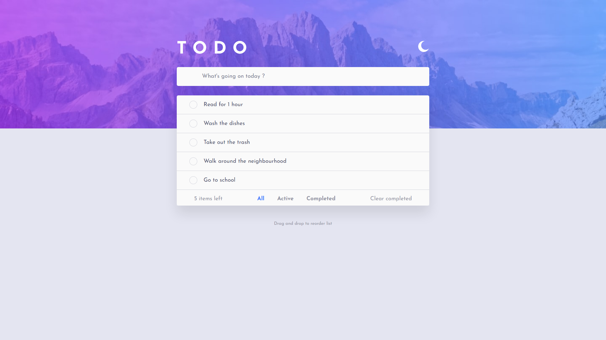

# Frontend Mentor - Todo app

## The challenge

The challenge was to build out this countdown timer and get it looking as close to the design as possible.

What users can do on this page:

- View the optimal layout for the app depending on their device's screen size
- See hover states for all interactive elements on the page
- Add new todos to the list
- Mark todos as complete
- Delete todos from the list
- Filter by all/active/complete todos
- Clear all completed todos
- Toggle light and dark mode
- **Bonus**: Drag and drop to reorder items on the list

## Giving Feedback

Any feedback on the code is welcome, thanks for sharing !
